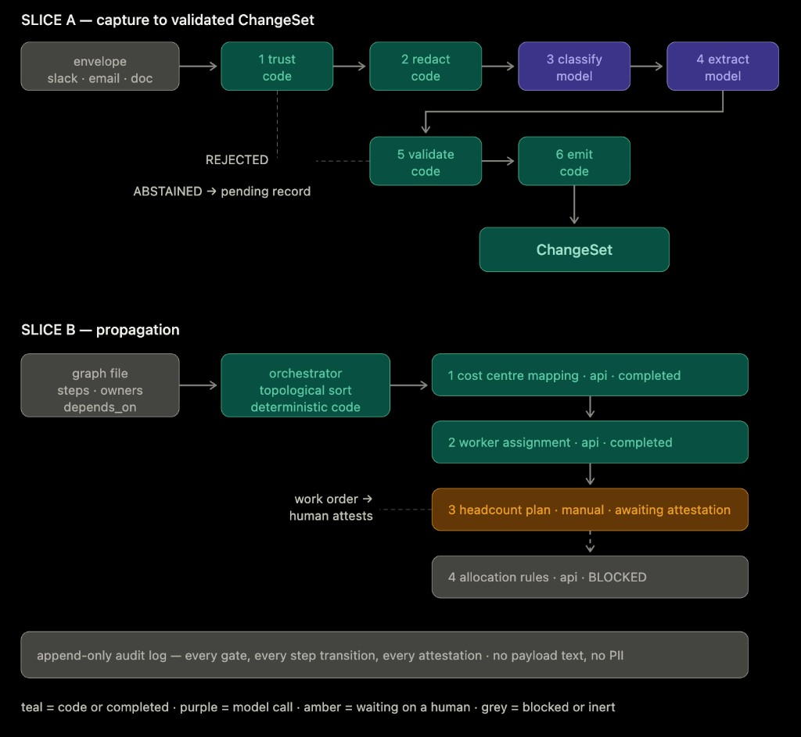
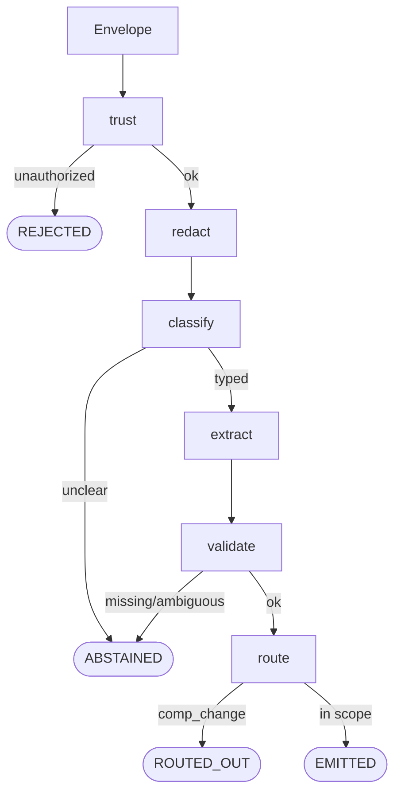
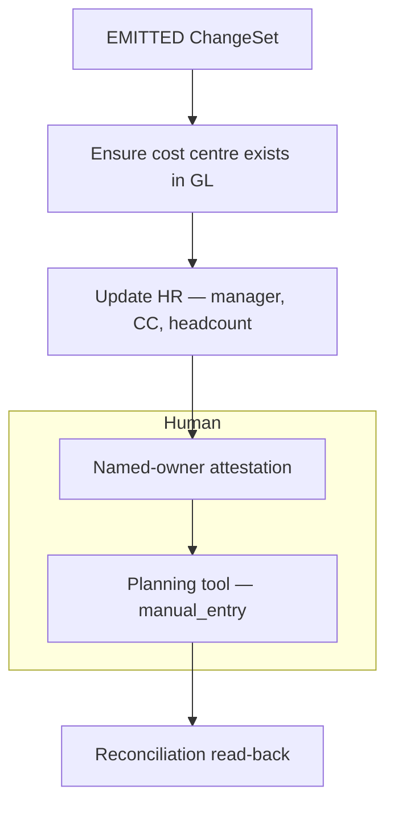

# Reorg change pipeline — design doc

**FDE take-home — Agentic-Driven Reorgs.** A Node 20 CLI prototype plus this document. Slice A is fully functional (real model calls); Slice B walks a declared graph with stub adapters (no HTTP). Demo: `npm test`. The detailed working log — every decision and why — is `docs/decisions.md`.

---

## 1. Summary

Today a reorg is a freeform Slack/email from an HR partner, plus a checklist that lives in one person's head. People, planning, and finance systems are updated by hand, in an order nobody wrote down. Errors surface weeks later in reports.

This system turns that message into a **validated ChangeSet** ("what changed"), then drives a **declared dependency graph** ("what must happen, in what order"). A model reads meaning; **code decides every action**; a human stays only where a system has no API or a control needs a named approver.

**Two bets; everything else follows from them:**

1. **Split capture from propagation.** Slice A = intake → ChangeSet. Slice B = ordered writes. The company's real problem is *order*, not parsing — so order is a **data artifact**, not something a model re-derives each run.
2. **The model returns values; code decides actions.** Every model call is a forced-tool call against a closed schema. No model call has a side-effect tool — so a prompt injection has nothing to reach.

### Brief constraints → what we did

| Constraint | What we did |
| --- | --- |
| Reorgs arrive as **freeform text**; no structured event to subscribe to. | Envelope `{ message_id, source, sender, received_at, text }`. `text` is untrusted. Fixtures stand in for connectors. |
| At least one target system **has no API**; a human keys it. | Slice B `mode: manual_entry`: a field-level work order until a human `attest`s. |
| Data includes **compensation and PII**. | Redact salary/SSN/account/email/phone before the model. Comp is a boolean, never an amount; `comp_change === true` → **ROUTED_OUT**, not a write here. |
| Some steps need **human approval**. Decide which, and where. | §3.4. Short version: clarification in Slice A; GL/control attestation and API-less entry as **policy fields on the graph step**. Approval is never a model tool. |

---

## 2. Goals and non-goals

**Goals.** Accept untrusted freeform text; decide **who may submit** from metadata before any model call; produce a structured ChangeSet **or ask a specific question** instead of guessing; keep comp/PII out of logs, model calls, and writes; make propagation **order a declared artifact** owned by FP&A/HR Ops; keep a human where there's no API, a control, or an incomplete request.

**Non-goals (deliberate).**

| Left out | Why |
| --- | --- |
| Slack/email connectors | Ingest is assumed; identity proof (Slack signing, SPF/DKIM) belongs in the connector, not `checkTrust`. |
| Writing compensation | Different approval chain. A pipeline that never writes salary can tokenize and discard it. |
| Autonomous agent / tool-loop | The steps *can* be enumerated. A model re-deriving a known checklist trades auditability for nothing. |
| Durable execution engine, UI, real GL adapters | Out of the time box. The seams are designed below; a pending record and stub adapters demonstrate the same transitions. |

---

## 3. Approach and design

### 3.1 End-to-end

```
freeform message
  → envelope (connector stamps source, sender, received_at)
  → Slice A: trust → redact → classify → extract → validate → route
       REJECTED | ABSTAINED | ROUTED_OUT | EMITTED ChangeSet
  → Slice B: graph orchestrator (gated writes + attestations + one manual-entry step)
  → reconciliation read-back (change landed, not just attested)
```

Building blocks: **prompt chaining** (classify, then extract) and **forced tool use** (closed JSON schema). Not used: an orchestrator-worker or ReAct loop — ordering is a correctness constraint (a cost centre must exist in the GL before HR can reference it), and a nondeterministic executor can't be gated or audited.



*Figure 1. Teal = code / completed step. Purple = model call. Amber = waiting on a human. Grey = input, blocked, or audit. Both slices are implemented; Slice B adapters are stubs (no HTTP). The four propagation boxes are one example graph, not the only legal sequence.*

### 3.2 Slice A — message → validated ChangeSet

| Component | Role |
| --- | --- |
| `checkTrust` | Allowlist + allowed source + ISO timestamp. **Never reads `text`.** Runs before any model call. |
| `redact` | Pure regex. Salary/SSN/account/email/phone → tokens. Names, CC codes, dates, headcount, worker IDs survive. Token map is process-local — never audited, persisted, or sent to the model. |
| `classify` | Claude + forced tool. Enum type only; unclear → abstain. |
| `extract` | Fills structural fields as written (names, CC codes — never IDs). Reports `comp_change: boolean`, never the amount. |
| `validate` | Required fields, then resolves names/codes against reference tables. Missing field, 0 or 2+ matches, or inactive CC → abstain. |
| route / emit | `comp_change === true` → ROUTED_OUT. Else write the ChangeSet (idempotent). |

**Four outcomes** (collapsing them loses the product):

| Outcome | Meaning |
| --- | --- |
| **REJECTED** | Not allowed to submit. No model call. |
| **ABSTAINED** | Allowed but can't finish (missing field, unclear type, failed model call). Asks a specific question; parks a pending record. |
| **ROUTED_OUT** | Real change, wrong workflow (comp review). |
| **EMITTED** | Structural ChangeSet complete and in scope. |



*Figure 2. Classify and extract are the only model calls (forced-tool); every other node is code.*

An abstention persists a **pending record** (missing fields + the question + a correlation key), keyed by a deterministic `change_id` (`sha256(message_id)`), and resumes at **validate** — the text was already classified and extracted. This is intake state, not durable execution: in production it belongs on Temporal/Step Functions, which would replace the pending *file*, not the design.

Fixtures (`fixtures/envelopes/`) are a regression suite: each carries an `expected_outcome`. All **three in-scope types** — team move, manager change, cost-center split — run through the **same pipeline with no new code** (a new type costs a schema, reference rows, and a graph, not a code branch).

### 3.3 Slice B — ChangeSet → propagation

The graph is **data**, not a prompt:

- Each step declares: system, write (or `mode: manual_entry`), dependencies, owner, and whether it needs attestation/approval.
- Code walks it in dependency order; a step is runnable only when its parents are `completed`.
- **Policy lives as data.** Approvers are a field on the step — FP&A can change an owner without a deploy.
- **Graph contents come from FP&A/HR Ops interviews**, not from engineering inventing the checklist. Engineering owns the schema, orchestrator, and gating.



*Figure 3. Example graph for one team move (`node src/cli.js propagate`). Edges mean "must complete before." `manual_entry` exists because the planning tool has no API; attestation is a control. Adapters are stubs — they log the payload they would send.*

Write principles: **absolute values, never deltas** (`setHeadcount(org, 16)` is retry-safe; `+6` corrupts). **Prefer loud failure** (double-counted headcount shows up in a rollup; orphaned headcount looks fine until close). Re-runs are idempotent (`change_id:step_id` never executes twice). Approval is an **event** (`approval_recorded`, actor + timestamp), not a resting status.

### 3.4 Where a human stays in the loop — and why

Not every step. Controls and missing APIs stay; capture guesses do not get rubber-stamped by the model.

| Step | Human? | Where it lives |
| --- | --- | --- |
| Who may submit | No — **allowlist** | `checkTrust` (code), before any model call |
| Incomplete / unclear request | **Clarification**, not approval | Pending record → ops owner (Slack task in prod) |
| Compensation on the request | Yes, **not here** | **ROUTED_OUT** to comp review |
| Cost centre exists in GL | Yes — **control** | Graph field: `awaiting_attestation` → named owner |
| Planning tool (no API) | Human **is** the write | `mode: manual_entry` until attested |
| After any write | Attestation is a **claim** | Reconciliation read-back: did the value land? |

The submitter (HRBP who sent the message) has the missing fact; the **ops owner** (who holds the checklist today) gets the task with a `change_id` and chases it. Same staffing as today — the difference is the incomplete request is now a tracked task, not a message that died in a channel. If comp had to be in scope, it would use the **same `manual_entry` mechanism** with a comp approver — never a salary field on the automated path.

### 3.5 Prompt injection

Handled by **containment**, not a detector. Classify/extract can only emit values from a closed schema; there is no tool that means "approve" or "skip the gate."

- **Fixture 04:** real team move + "ignore instructions / skip approval" → **EMITTED** (rejecting it would drop a legitimate reorg over pasted text).
- **Fixture 05:** jailbreak only, no reorg → **ABSTAINED**.

---

## 4. Alternatives considered

| Alternative | Why not |
| --- | --- |
| **One model call that "handles the reorg"** | Mixes authorization, PII, extraction, and side effects; injection gets an action surface; can't regression-test pieces. |
| **Tool-loop agent picks propagation order** | Order is physically constrained and must be auditable. Nondeterministic execution *is* the failure mode we're replacing. |
| **n8n / low-code workflow** | Fine for glue. The judgment here is trust boundaries, closed schemas, and a declared graph — more reviewable as a script with fixtures. |
| **Write compensation in this pipeline** | Requires cleartext salary in memory and payloads plus a second approval chain. Tokenize-and-discard only works if we never write it. |
| **Model confidence as the gate** | Not auditable, not fixture-testable. Gate on required fields instead. |
| **Two outcomes (pass/fail)** | "Not authorized," "missing a date," and "belongs in comp review" are different events. HR wouldn't use a parser that only says *rejected*. |

---

## 5. Risks and failure modes

**1. Wrong or incomplete ChangeSet is emitted.** *Blast:* HR/GL updated from a bad date or wrong manager; report errors weeks later — the original problem. *Detect/handle:* abstain on missing required fields (never default a date); temperature 0 + forced enums + fixture suite; don't gate on model confidence.

**2. Propagation runs in the wrong order, or a step is skipped.** *Blast:* cost centre missing in GL, HR write points at a ghost CC; allocations and reports diverge. *Detect/handle:* dependencies are data, a step can't start until parents are `completed`, the orchestrator never asks the model for order; reconciliation read-back after attestation.

**3. Sensitive values leak, or an injected instruction executes.** *Blast:* salary in logs/traces, or a pasted "skip approval" actually skips a control. *Detect/handle:* redact before the model; audit never stores `text` or the token map; model calls have no side-effect tools; comp is ROUTED_OUT so salary never becomes a write.

*Smaller, named:* concurrent reorgs on the same CC (last-write-wins in the prototype); entity resolution ("Priya's team" → worker IDs); out-of-band manual edits the graph can only detect after read-back.

---

## 6. Assumptions and open questions

**Assumptions:** an allowlist of submitters exists and is the Slice A authorization source; connectors stamp `source`/`sender` after channel-level proof; volume is tens of reorgs per quarter (an extra classify call is cheap, auditability isn't); at least one downstream system has no API; graph *contents* come from FP&A/HR Ops interviews. Retroactive (past-dated) reorgs are flagged and still emit; only the **closed-period** case is deferred.

**Open before the business can rely on it, in order:**

1. **Reconciliation read-back** — attestation and approval are claims, not proof; nothing yet reads the target system back, so a mistyped manual entry looks identical to success.
2. **Escalation on stalled human gates** — pending clarifications and awaiting-attestation steps have no SLA or reminder; a stalled reorg looks like one nobody is working on.
3. **Concurrent changes to the same cost centre** — prototype state is last-write-wins; no locking.

Then: retroactive-into-closed-period (needs the close calendar); documented entity-resolution strategy; ownership/change-control of the graph file; which gate comes off first once accuracy data exists (GL approval gates stay — they're controls).

---

## 7. What to demo

```bash
npm test                                 # redact checks + Slice B graph walk + 14-fixture suite
node src/cli.js --all                    # every fixture vs its expected_outcome (all 3 types)
node src/cli.js propagate <change_id>    # Slice B: gated writes + human attest/approve, no model
```

`README.md` has the human-in-the-loop `pending`/`answer` walkthrough and Slice B `propagate`/`attest`/`approve`.

---

## 8. How I used AI, and where I overrode it

**Shaped:** the core move was a **code-vs-model table** — what can be written down in advance → code; what requires reading meaning → model. That table *is* the architecture (trust/redact/validate/graph in code; classify/extract as constrained model calls).

**Overridden:** a generated first pass treated validation failure as `REJECTED` — split out **ABSTAINED** (a missing date isn't "not allowed"); added a fourth outcome **ROUTED_OUT** for compensation; collapsed a duplicate submitter lookup; normalized case-sensitive email matching; made `--all` check each fixture's `expected_outcome` instead of treating all-rejected as success.

**Considered and rejected (incl. AI suggestions):** model-chosen propagation order; model confidence as a gate; a persistent token vault.
