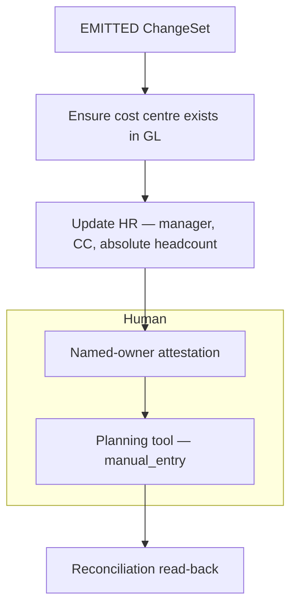

# Reorg change pipeline — design doc

**Role context:** FDE take-home (Agentic-Driven Reorgs). Time-boxed prototype + this document.  
**Prototype:** `reorg-pipeline` (Node 20 CLI). Slice A is functional. Slice B walks a declared graph with stub adapters (no model, no HTTP).  
**Demo:** `node src/cli.js --all`

This document is the submission. `docs/decisions.md` is the working log it was distilled from.

---

## 1. Summary

A reorg today is a freeform Slack/email from an HR partner, plus a checklist that lives in one person’s head. People, planning, and finance systems are updated by hand, in an order that is not written down. Errors show up weeks later in reports.

This system turns that freeform message into a **validated ChangeSet** (“what changed”), then drives a **declared dependency graph** (“what must happen, in what order”) with humans only where a system has no API or a control requires a named approver.

**Outcome of a good run:** an authorized request becomes a structural ChangeSet, then a gated sequence of writes and attestations — not a model inventing the checklist, and not this pipeline writing compensation.

The prototype demonstrates the judgment-heavy half: **capture → trust → redact → classify → extract → four explicit outcomes.** It never touches a target system.

There is no single correct architecture. The brief grades reasoning: what we assumed, what we refused to build, and where a human stays. Those answers are below; the working log is `docs/decisions.md`.

### Constraints (from the brief)

| Constraint | What we did |
| --- | --- |
| Reorgs arrive as **freeform text** (Slack, email, docs). No structured event to subscribe to. | Envelope `{ message_id, source, sender, received_at, text }`. `text` is untrusted. Fixtures stand in for connectors. |
| At least one target system **has no API**; a human must key the change. | Slice B `mode: manual_entry` on the planning tool: a field-level work order until `attest`. |
| Data includes **compensation and PII**. | Redact before the model (salary, SSN, account, email, phone). Token map never persisted, audited, or sent to the model. Comp is a boolean; amount never extracted. `comp_change === true` → **ROUTED_OUT**, not a write in this pipeline. |
| Some steps need **human approval** before downstream work. Decide which, and where it lives. | Table in **3.4**. Short version: clarification and extraction-confirm in Slice A; GL/control attestation and API-less entry on the **graph step** (policy as data). Approval is not a model tool. |

**Notes (from the brief), how we followed them:** if something was unclear we **stated an assumption and kept building** (§6). **Why we didn’t build it** is a deliverable — §2 non-goals and §4 alternatives. **§8** is where AI shaped a decision and where it was overridden.

---

## 2. Goals and non-goals

### Goals

- Accept reorg requests as **untrusted freeform text** (Slack, email, doc, manual). There is no structured event to subscribe to.
- Decide **who may submit** from envelope metadata only, before any model call.
- Produce a **structured ChangeSet** for in-scope structural changes (team move, cost-center split, manager change), or **ask a specific question** instead of guessing.
- Keep **compensation and PII** out of logs, model side-effects, and downstream writes.
- Make the **propagation order** a declared artifact owned by FP&A / HR Ops — auditable, not re-derived per run.
- Leave a **human in the loop** where there is no API, where a control requires approval, or where the request is incomplete / out of workflow.

### Non-goals (deliberate)

| Left out | Why |
| --- | --- |
| Slack/email connectors | Ingest is assumed. Fixtures pretend a connector already stamped `source` and `sender`. Identity proof (Slack signing, SPF/DKIM) belongs in that connector, not in `checkTrust`. |
| Writing compensation | Different approval chain. A pipeline that never writes salary can tokenize and discard it. |
| Persistent token vault | Would be a new sensitive store plus a correlation surface for data this workflow does not need. |
| Autonomous agent / tool-loop | The steps *can* be enumerated. Using a model to re-derive a known checklist trades auditability for nothing. |
| UI | Work orders and a CLI trace are more reviewable in a 3–4 hour slice. |
| Slice A waiting inbox / resume job | We persist a pending *record* (fields + question), not a parked execution. Temporal / Step Functions would replace `out/pending/` later. |
| Production identity, locking, or GL adapters | Out of the time box. Designed below; not implemented. |

---

## 3. Approach and design

### 3.1 End-to-end path

```
freeform message
  → envelope (connector stamps source, sender, received_at)
  → Slice A: trust → redact → classify → extract → validate → route
       REJECTED | ABSTAINED | ROUTED_OUT | EMITTED ChangeSet
  → Slice B: graph orchestrator (gated writes + attestations + one manual-entry step)
  → reconciliation read-back (change landed, not just attested)
```

**Agentic building blocks actually used:** prompt chaining (classify, then extract) and **forced tool use** (closed JSON schema). The model returns **values**. Code (`if` / `switch`) produces **actions**. No model call has a tool with a side effect.

**Not used:** an orchestrator-worker or ReAct loop. Ordering is a correctness constraint (a cost centre must exist in the GL before HR can reference it). A nondeterministic executor cannot be gated or audited.


*Figure 1. End-to-end. Teal = code (or a completed graph step). Purple = model call. Amber = waiting on a human. Grey = input, blocked, or audit. **Slice A and Slice B are both implemented** — Slice B adapters are stubs (no HTTP). The four propagation boxes are an example graph, not the only legal sequence.*

Read the picture the same way as the rest of this doc:

- **Looking up** “Maya Chen” / CC-4100 is Slice A **validate** (fixture tables). Slice B steps 1–2 are **API writes** of those IDs, not the lookup.
- **REJECTED** is trust. **ABSTAINED → pending** is classify or validate (the dashed note is compressed onto the left).
- **ROUTED_OUT** (comp) is not drawn; it sits between validate and emit when `comp_change === true`.
- The audit bar is `out/audit.jsonl` today — same events, no payload text. It is not a notification (see below).

Keep this file in **git**, next to the code. A Google Doc is a fine extra for emailing a hiring manager; it is not a replacement. Reviewers clone the repo.

### 3.2 Slice A — capture to validated ChangeSet (prototype)

Components and interfaces:

| Component | Interface | Role |
| --- | --- | --- |
| Envelope | `{ message_id, source, sender, received_at, text }` | Transport wrapper. `text` is untrusted. |
| `checkTrust` | `(envelope, { authorizedSubmitters }) → { ok, submitter \| reason }` | Allowlist + allowed sources + ISO timestamp. **Never reads `text`.** |
| `redact` | `text → { redacted, tokens }` | Pure regex. Salary, SSN, account, email, phone → tokens. Names, CC codes, dates, headcount, worker IDs survive. Token map is process-local; never audited, never persisted, never sent to a model. |
| `classify` | `redacted → { type, confidence }` | Claude + forced tool `emit_classification`. Enum only. Unclear → abstain. |
| `extract` | `(redacted, classification) → ChangeSet` | Fills structural fields as written (names, CC codes). Reports `comp_change: boolean`, **never the amount**. Does not look up IDs. |
| `validate` | `ChangeSet → { ok, missing[], question }` | Required fields, then **name/code resolution** against `fixtures/reference/managers.json` and `cost_centers.json`. Missing date, 0 matches, 2+ Alex Riveras, or `active: false` → abstain. Not Slice B. |
| Route / emit | ChangeSet → outcome | `comp_change === true` → `ROUTED_OUT`. Else write `out/changesets/<change_id>.json` (idempotent). |
| Audit | `{ ts, message_id, step, status, reason? }` | JSONL. No payload text. Not a notification. |

Four outcomes (collapsing them loses the product):

| Outcome | Meaning |
| --- | --- |
| **REJECTED** | Not allowed to submit. Log it; stop. |
| **ABSTAINED** | Allowed; cannot finish. Missing field, unclear type, or a failed model call. Specific question. Run ends. |
| **ROUTED_OUT** | Allowed; real change; **wrong workflow** (comp review). Offer to continue the structural move alone. |
| **EMITTED** | Structural ChangeSet complete and in scope. |


*Figure 2. Slice A as implemented in the prototype (`node src/cli.js --all`). Trust does not read `envelope.text`. The redact token map is not passed to the model and is not written to the audit log. Classify and extract are forced-tool model calls; every other node is code. Figure 1 is the same pipeline with Slice B attached.*

Fixtures are a regression suite (`expected_outcome` on each file). `source` is pretend ingest; `expected_outcome` is the answer key for what the pipeline should decide after that. `--all` succeeds when 02 is rejected and 07 is routed out. Manager/CC lookup is **validate** (Slice A): 01 resolves Hale/Chen and CC-4100/4200; 09 abstains on two Alex Riveras; **12** abstains on inactive CC-4300. Slice B would *write* those IDs later; it does not do the matching. Full list is in `README.md`.

All three in-scope types are exercised, not just `team_move`. Fixtures **01–12** are `team_move` — the fully worked type, happy path plus every abstention edge. **13** (`manager_change`) and **14** (`cost_center_split`) are the other two, and they emit through the **same pipeline with no new code**: classify/extract already carry a schema per type, `validate` already has required-field and resolution rules per type, and each type has its own `graph/<type>.json`. Adding a type cost fixtures, reference rows, and a graph — not a code branch. That is the concrete evidence for "the model returns values, code decides actions, the graph is data": if generalizing had needed new pipeline code, the abstraction would have been leaking.

Three fixtures look surprising until you separate *mention* from *change* and *past* from *closed period*:

- **06 (EMITTED, not routed out).** The text names a salary but states no compensation change. Redact strips the amount before the model, `extract` returns `comp_change: false`, and the structural move emits. A figure named in passing is not a comp event, and the pipeline never needed the number — contrast **07**, where the text states an actual raise, so `comp_change === true` → **ROUTED_OUT**. The distinction is "is compensation *changing*," not "does the word salary appear."
- **10 (EMITTED with a flag, not blocked).** A *past* effective date is not malformed, and refusing it would drop a legitimate backdated move. `validate` attaches a `retroactive_effective_date` note and emits; the flag is what lets a human or a later control notice it. Whether a retroactive date falls in an already-**closed** period — a different, narrower question the prototype cannot answer without the close calendar — is the item deferred in §6. Past-but-open dates are handled here; closed-period dates are the open question, and conflating the two is the mistake this fixture guards against.
- **11 (ABSTAINED on a failed call).** A forced model timeout after trust/redact abstains with a resubmit question rather than crashing or writing a half ChangeSet — the "a failed model call" branch of the outcomes table above, proven rather than asserted.

#### Resuming an abstention

When Slice A abstains, it writes a pending record containing the missing fields, the question asked, the correlation key (Slack `thread_ts` or email `In-Reply-To`), and the partial extraction — then exits. The clarification arrives as a separate inbound event and is matched back by correlation key. Resuming re-runs only validation and emit: the text was already classified and extracted, and re-running the model calls would be both wasted spend and non-deterministic.

`change_id` is derived deterministically from `message_id` (`chg_` + first 8 hex chars of `sha256(message_id)`), so reprocessing the same inbound message produces the same identifier. Slice B keys step state on `change_id:step_id`, so this is what prevents one reorg's step state from being attributed to another on a redelivery.

This is deliberately not durable execution. In production this workflow belongs on Temporal or Step Functions, where a human gate is a suspended await on a signal and the engine handles persistence, timeouts, and replay — a reorg can plausibly wait days for a finance owner. That is the correct tool, but it is infrastructure rather than judgment, and the same state transitions are demonstrable with a pending record and two CLI commands. The pending record is the seam: adopting a durable engine replaces the persistence, not the design.

```bash
node src/cli.js pending
node src/cli.js answer <change_id> --effective-date 2026-10-01
```

In the prototype, `pending` prints each saved question and the exact `answer` command to copy. That list is `out/pending/*.json` in the terminal — not Slack, not a web inbox. Production still pages the one ops owner; the CLI is the stand-in.

Two gaps are known and unaddressed. Unanswered abstentions have no timeout, reminder, or escalation — a silently stalled change is indistinguishable from one that was never submitted, and this is the same gap that applies to unattested manual steps in Slice B. And correlation depends on the platform's threading; a human who replies in a new thread instead of the original will not be matched, which in production needs either a visible correlation token or a fallback matching path.

The pending file does **not** store `envelope.text` or the redaction token map — only already-redacted extracted fields.

#### Audit is not a notification

`out/audit.jsonl` answers “what happened to this `message_id`?” on disk — for you now, and for an interviewer later. It does **not** store the email, salary, or a resume token. It is **not** AWS. It is **not** a notification.

| Job | Today | Later, if you productionize |
| --- | --- | --- |
| **Trail of steps** | `out/audit.jsonl` | Ship the **same small events** to CloudWatch / Datadog (still no raw text) |
| **“Something needs a human”** | Printed in the CLI; pending record on disk | Slack task to the one ops owner on `ABSTAINED` / `ROUTED_OUT` |
| **Resume from a missing field** | `answer` re-enters at validate from `out/pending/` (state, not a parked execution) | Same record shape in Temporal / Step Functions |

Logs and notifications are **two pipes**. A log tells you the step failed. A Slack task tells **one person** to answer “which Alex Rivera?” Without that second pipe, a jsonl file in `out/` is only useful if someone opens it.

### 3.3 Slice B — validation to propagation

The company’s actual problem is order, not parsing. The graph is **data**, not a prompt:

- Each step has: system, write (or `mode: manual_entry`), dependencies, owner, whether it needs attestation.
- Code walks the graph: a step is runnable only when dependencies are `completed`.
- **Policy lives as data.** Approvers are a field on the step. FP&A can change an owner without a deploy.
- **Graph contents are not engineering knowledge.** They come from structured interviews with the people who currently hold the checklist. Engineering owns the schema, the orchestrator, and the gating semantics.



*Figure 3. Example Slice B graph for one team move — executed by `node src/cli.js propagate` against `graph/team_move.json`. Same idea as the right half of Figure 1 (a different example sequence is fine: graph contents come from FP&A / HR Ops interviews). Edges mean “must complete before.” Attestation is a control; `manual_entry` exists because the planning tool has no API. Compensation writes are not on this path. Adapters are stubs: they log the payload they would send.*

Writes:

- **Absolute values, never deltas.** `setHeadcount(org, 16)` is idempotent; `adjustHeadcount(org, +6)` corrupts on retry.
- **Prefer loud failures.** Double-counted headcount shows up in a rollup; orphaned headcount looks fine until close.
- **Atomicity inside a manual step is instructed, not enforced.** `update_headcount_plan` tells the human not to split the decrement and increment. This system cannot observe the planning tool, so it cannot keep that promise in code. There is no `atomic_with` field — an empty one would look like a guarantee the orchestrator does not keep.

Approval is an **event**, not a status. `approve` writes `event: "approval_recorded"` (actor + timestamp) and sets `approved_at`. The status change that follows is `awaiting_approval → completed` when the adapter runs. `approved` is not a resting state.

Prototype: `node src/cli.js propagate <change_id>` walks `graph/<type>.json`, writes `out/state/<change_id>.json`, and is safe to re-run (`${change_id}:${step_id}` never executes twice). `attest` and `approve` are the human gates. Adapters stub in `src/lib/adapters.js`. Not built: real HTTP, retries, timeouts, escalation, parallel execution, rollback.

### 3.4 Where a human stays in the loop — and why

The brief asks us to **decide which steps require approval and where that approval lives.** Not every step. Controls and missing APIs stay; capture guesses do not get rubber-stamped by the model.

| Step | Approval? | Where it lives |
| --- | --- | --- |
| Who may submit | No human click — **allowlist** | Slice A `checkTrust` (code), before any model call |
| Incomplete / unclear / failed extract | Yes: **clarification**, not approval of a write | Slice A pending record; prototype CLI `pending`/`answer`; production Slack task to the **ops owner** |
| Compensation on the request | Yes, but **not here** | **ROUTED_OUT** to comp review. Confirm-and-continue (structural move only) is a second submit, not built |
| Extraction confirmation (“is this ChangeSet right?”) | Yes until accuracy data exists | After **EMITTED**, before Slice B starts. Candidate to remove first (§6) |
| Cost centre exists in GL | Yes — **control**, not UX | Graph field on that step: `awaiting_attestation` → named owner (FP&A / Controllership) |
| HR write (manager, CC, headcount) | After GL parent is `completed`; attest if the graph says so | Same mechanism: policy on the step, not a deploy |
| Planning tool (no API) | Human **is** the write | `mode: manual_entry` until attested |
| After any write | Attestation is a **claim** | Reconciliation read-back: did the value land? |

Production attestation belongs in Slack, where approvers already work. The click must authenticate the actor; it is an authorization event, not a notification ack.

If compensation had to be in scope: **same mechanism** as the API-less tool — `mode: manual_entry` with a comp approver. Different reason (sensitivity vs missing API). Still no salary field on the automated path. That is a stronger answer than “we excluded it.”

Abstention resume (pending record, `change_id`, why this is not Temporal) is in **3.2**. Who gets the Slack task is below.

**Who is pinged.** Two different people, and the bot does not skip the owner.

| Role | Who | What they do on ABSTAINED |
| --- | --- | --- |
| **Submitter** | The HRBP / Legal Ops person who sent the original Slack or email (Priya). | Has the missing fact (the date, which Alex Rivera). They are not given a new app and they are not the queue owner. |
| **Ops owner** | The one person who today holds the checklist in their head. | Gets a Slack **task** (not a new product): the specific question + a link back to the original message. They chase the answer, then fill the pending record (`answer` in the prototype; a Slack modal or thread reply in production). |

Production does **not** mean “email the submitter a form and wait.” It means: post a task to the owner where they already work. Typical hop is owner → original thread → “what’s the effective date?” → owner patches the pending fields. A bot *may* post that question in-thread as a convenience, still on behalf of the owner — it is not an unattended reply-all to whoever mailed in.

That is the same staffing model as today (one owner). The change is that the incomplete request is a visible task with a `change_id`, not a message that died in a channel.

Slice B attestation remains a true user task (`awaiting_attestation → completed`) once a ChangeSet exists.

### 3.5 Prompt injection

Handled by **containment**, not a detector. Classify/extract can only emit values from a closed schema. There is no tool that means “approve” or “skip the gate.”

- Fixture **04**: real team move + “ignore instructions / skip approval” → **EMITTED**. Rejecting it would drop a legitimate reorg because of pasted text.
- Fixture **05**: jailbreak only, no reorg → **ABSTAINED**.

---

## 4. Alternatives considered

| Alternative | Why not |
| --- | --- |
| **n8n / low-code agent workflow** | Fine for glue. The judgment here is trust boundaries, closed schemas, and a declared graph. A script with fixtures is more reviewable in this time box. |
| **One model call that “handles the reorg”** | Mixes authorization, PII, classification, extraction, and side effects. Injection gets an action surface. Cannot regression-test pieces. |
| **Tool-loop agent picks propagation order** | Order is physically constrained and must be auditable. Nondeterministic execution is the failure mode we are replacing. |
| **Write compensation in this pipeline** | Requires cleartext salary in memory and API payloads, plus a second approval chain. Tokenize-and-discard only works if we never write it. |
| **Persistent token vault** | New secrets store + correlation (`[SALARY_1]` across runs) for data the workflow does not need. |
| **Model self-reported confidence as the gate** | Not auditable, not fixture-testable. Gate on required fields instead. |
| **Reject any message that looks like injection** | Drops legitimate reorgs (fixture 04). Contain the call instead. |
| **Two outcomes (pass / fail)** | “Not authorized” and “missing effective date” and “belongs in comp review” are different events. HR would not use a parser that only says rejected. |
| **Park Slice A as a durable execution** | Right for Slice B attestation. For intake we persist a pending *record* and re-enter at validate. A Temporal runtime would replace `out/pending/`, not a half-written ChangeSet plus the email body. |

---

## 5. Risks and failure modes

The two or three that matter, blast radius, detection.

**1. Wrong or incomplete ChangeSet is emitted**  
*Blast:* HR and GL updated from a bad date, wrong manager, or invented team. Weeks-later report errors — the original problem.  
*Detect / handle:* Abstain on missing required fields (never default a date). Temperature 0 + forced enums + fixture suite. Extraction-confirmation gate stays until accuracy data exists. Do not use model confidence as the gate.

**2. Propagation runs in the wrong order, or a step is skipped**  
*Blast:* Cost centre missing in GL, HR write fails or points at a ghost CC; allocations and reports diverge.  
*Detect / handle:* Dependencies are data; a step cannot start until parents are `completed`. Orchestrator does not ask the model for order. Reconciliation read-back after attestation.

**3. Sensitive values leak, or an injected instruction executes**  
*Blast:* Salary in audit logs / model traces; or a pasted “skip approval” actually skips a control.  
*Detect / handle:* Redact before the model; audit never stores `text` or the token map. Model calls have no side-effect tools. Comp changes `ROUTED_OUT` so salary never becomes a write.

Smaller, named: concurrent reorgs on the same CC (last-write-wins in a prototype store); entity resolution (“Priya’s team” → worker IDs); out-of-band manual updates the graph cannot prevent, only detect after read-back.

---

## 6. Assumptions and open questions

### Assumptions (stated so we could keep building)

- An **allowlist** of submitters (HRBP, Legal Ops) exists and is the authorization source for Slice A.
- Connectors will **stamp** `source` / `sender` after channel-level proof (Slack HMAC, email auth). Fixtures simulate that.
- In-scope structural types for the prototype: team move, cost-center split, manager change. Headcount-only and CC-merge are representable later on the same ChangeSet path.
- Volume is tens of reorgs per quarter — an extra classify call is cheap; auditability is not.
- At least one downstream system **has no API**; that step is `manual_entry`.
- Graph **contents** will come from FP&A and HR Ops interviews, not from engineering inventing the checklist.
- Retroactive (past-dated) reorgs are **flagged and still emit** today (fixture 10). What is deferred is the narrower case where a retroactive date falls in an already-**closed** period — that stays out of the first graph until Controllership defines the rule.

### Open before the business can rely on it

If I had one more day, in this order:

1. **Reconciliation read-back** — attestation and `approve` are claims, not proof. Nothing today reads the target system back to confirm the value landed. Until this exists, a mistyped manual entry or a silently-failed adapter looks identical to success.
2. **Escalation on stalled human gates** — pending clarifications (§3.2) and `awaiting_attestation` / `awaiting_approval` steps (§3.3) have no SLA, timeout, or reminder. A stalled reorg is indistinguishable from one nobody is working on, and this is true on both sides of the Slice A / Slice B boundary.
3. **Concurrent changes to the same cost centre** — prototype state is last-write-wins; no locking.

Then, not yet urgent enough to be first:

- **Retroactive dates into a closed period** — needs the close calendar and a Controllership path.
- **Entity resolution** — production needs a documented match strategy and a no-match path, not only a fixture table.
- **Who owns the graph file in six months** — review, change-control, drift detection. Process, not code.
- **Which gate comes off first** — extraction-confirmation, once there is accuracy data. GL approval gates stay; they are controls.
- **Confirm-and-continue after ROUTED_OUT** — not built. It would be a second submit with `comp_change` stripped, not this pipeline writing salary.

---

## 7. Prototype vs design (what to demo)

```bash
cd ~/Documents/Projects/legal-reorg-intake
node scripts/test-redact.js              # PII / ID survival
node src/cli.js --all                    # 14 fixtures vs expected_outcome (all three types)
node scripts/test-slice-b.js             # graph walk, no model
node src/cli.js propagate chg_e81290fd   # team_move, after 01 has emitted
# the other two types propagate the same way, each against its own graph:
node src/cli.js propagate <chg from 13>  # manager_change  → graph/manager_change.json
node src/cli.js propagate <chg from 14>  # cost_center_split → graph/cost_center_split.json (finance_owner approval gate)
```

See `README.md` for setup, the `pending` / `answer` walkthrough, Slice B `propagate` / `attest` / `approve`, and the full fixture list (01–14). Manager and cost-centre tables are consulted in **validate**, not in the graph.

---

## 8. Where AI shaped this, and where it was overridden

The homework asks for this explicitly.

**Shaped:** Working from the problem to a code-vs-model table (what can be written down in advance → code; what requires reading meaning → model). That table is the architecture: trust/redact/validate/graph in code; classify/extract as constrained model calls.

**Overridden:**

- Generated pipeline treated validation failure as `REJECTED`. Split **ABSTAINED** (missing date is not “not allowed”).
- Compensation is not a reject or an abstain. Fourth outcome: **ROUTED_OUT**.
- Duplicate submitter lookup (authorize, then look up role again) — one function returns what it found.
- Case-sensitive email match — normalize.
- `--all` treating “everything rejected” as failure — per-fixture `expected_outcome` instead.

**Considered and rejected (including AI suggestions):** model-chosen propagation order; confidence as gate; persistent token vault.
