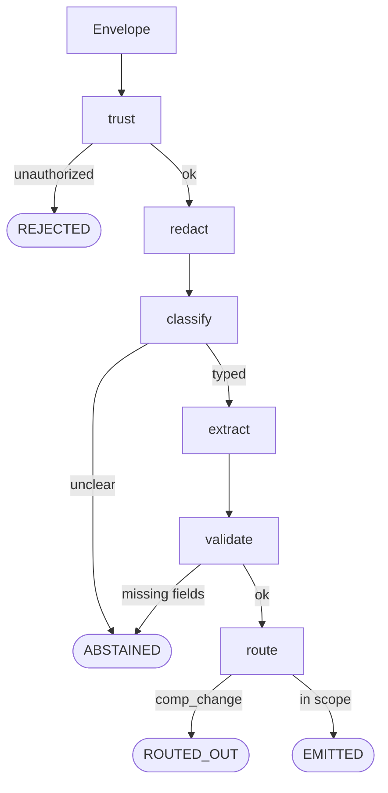
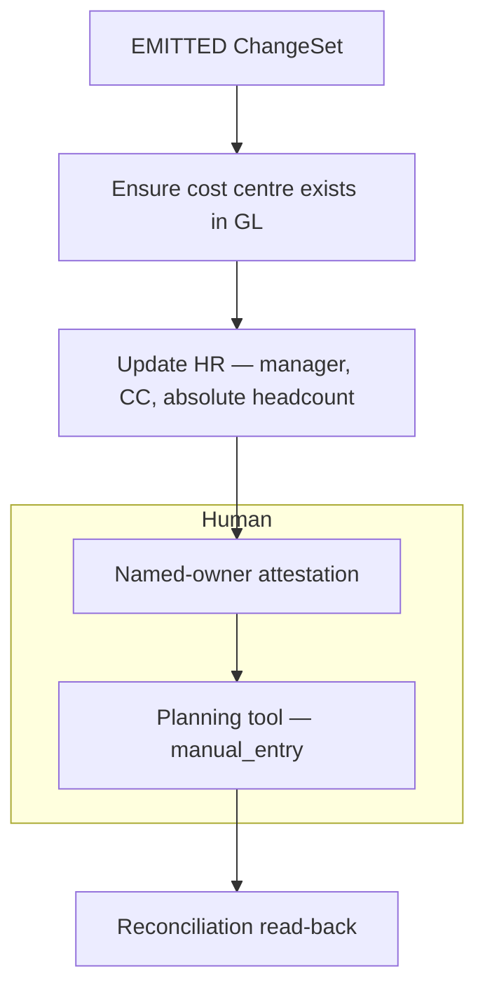

# Reorg change pipeline — design doc

**Role context:** FDE take-home (Agentic-Driven Reorgs). Time-boxed prototype + this document.  
**Prototype:** `reorg-pipeline` (Node 20 CLI). Slice A is functional. Slice B is designed, not built.  
**Demo:** `node src/cli.js --all`

This document is the submission. `docs/decisions.md` is the working log it was distilled from.

---

## 1. Summary

A reorg today is a freeform Slack/email from an HR partner, plus a checklist that lives in one person’s head. People, planning, and finance systems are updated by hand, in an order that is not written down. Errors show up weeks later in reports.

This system turns that freeform message into a **validated ChangeSet** (“what changed”), then drives a **declared dependency graph** (“what must happen, in what order”) with humans only where a system has no API or a control requires a named approver.

**Outcome of a good run:** an authorized request becomes a structural ChangeSet, then a gated sequence of writes and attestations — not a model inventing the checklist, and not this pipeline writing compensation.

The prototype demonstrates the judgment-heavy half: **capture → trust → redact → classify → extract → four explicit outcomes.** It never touches a target system.

---

## 2. Goals and non-goals

### Goals

- Accept reorg requests as **untrusted freeform text** (Slack, email, doc, manual). There is no structured event to subscribe to.
- Decide **who may submit** from envelope metadata only, before any model call.
- Produce a **structured ChangeSet** for in-scope structural changes (team move, cost-center split, manager change), or **ask a specific question** instead of guessing.
- Keep **compensation and PII** out of logs, model side-effects, and downstream writes.
- Make the **propagation order** a declared artifact owned by FP&A / HR Ops — auditable, not re-derived per run.
- Leave a **human in the loop** where there is no API, where a control requires approval, or where the request is incomplete / out of workflow.

### Non-goals (deliberate)

| Left out | Why |
| --- | --- |
| Slack/email connectors | Ingest is assumed. Fixtures pretend a connector already stamped `source` and `sender`. Identity proof (Slack signing, SPF/DKIM) belongs in that connector, not in `checkTrust`. |
| Writing compensation | Different approval chain. A pipeline that never writes salary can tokenize and discard it. |
| Persistent token vault | Would be a new sensitive store plus a correlation surface for data this workflow does not need. |
| Autonomous agent / tool-loop | The steps *can* be enumerated. Using a model to re-derive a known checklist trades auditability for nothing. |
| UI | Work orders and a CLI trace are more reviewable in a 3–4 hour slice. |
| Production identity, locking, or GL adapters | Out of the time box. Designed below; not implemented. |

---

## 3. Approach and design

### 3.1 End-to-end path

```
freeform message
  → envelope (connector stamps source, sender, received_at)
  → Slice A: trust → redact → classify → extract → validate → route
       REJECTED | ABSTAINED | ROUTED_OUT | EMITTED ChangeSet
  → Slice B: graph orchestrator (gated writes + attestations + one manual-entry step)
  → reconciliation read-back (change landed, not just attested)
```

**Agentic building blocks actually used:** prompt chaining (classify, then extract) and **forced tool use** (closed JSON schema). The model returns **values**. Code (`if` / `switch`) produces **actions**. No model call has a tool with a side effect.

**Not used:** an orchestrator-worker or ReAct loop. Ordering is a correctness constraint (a cost centre must exist in the GL before HR can reference it). A nondeterministic executor cannot be gated or audited.

### 3.2 Slice A — capture to validated ChangeSet (prototype)

Components and interfaces:

| Component | Interface | Role |
| --- | --- | --- |
| Envelope | `{ message_id, source, sender, received_at, text }` | Transport wrapper. `text` is untrusted. |
| `checkTrust` | `(envelope, { authorizedSubmitters }) → { ok, submitter \| reason }` | Allowlist + allowed sources + ISO timestamp. **Never reads `text`.** |
| `redact` | `text → { redacted, tokens }` | Pure regex. Salary, SSN, account, email, phone → tokens. Names, CC codes, dates, headcount, worker IDs survive. Token map is process-local; never audited, never persisted, never sent to a model. |
| `classify` | `redacted → { type, confidence }` | Claude + forced tool `emit_classification`. Enum only. Unclear → abstain. |
| `extract` | `(redacted, classification) → ChangeSet` | Fills structural fields. Reports `comp_change: boolean`, **never the amount**. |
| `validate` | `ChangeSet → { ok, missing[], question }` | Deterministic required fields. Missing date → abstain with a question, not a reject. |
| Route / emit | ChangeSet → outcome | `comp_change === true` → `ROUTED_OUT`. Else emit. |
| Audit | `{ ts, message_id, step, status, reason? }` | JSONL. No payload text. |

Four outcomes (collapsing them loses the product):

| Outcome | Meaning |
| --- | --- |
| **REJECTED** | Not allowed to submit. Log it; stop. |
| **ABSTAINED** | Allowed; most of it parsed; a required field is missing. Specific question. |
| **ROUTED_OUT** | Allowed; real change; **wrong workflow** (comp review). Offer to continue the structural move alone. |
| **EMITTED** | Structural ChangeSet complete and in scope. |



*Figure 1. Slice A as implemented in the prototype (`node src/cli.js --all`). Trust does not read `envelope.text`. The redact token map is not passed to the model and is not written to the audit log. Classify and extract are forced-tool model calls; every other node is code.*

Fixtures are a regression suite (`expected_outcome` on each file). `source` is pretend ingest; `expected_outcome` is the answer key for what the pipeline should decide after that. `--all` succeeds when 02 is rejected and 07 is routed out.

### 3.3 Slice B — validation to propagation (designed, not built)

The company’s actual problem is order, not parsing. The graph is **data**, not a prompt:

- Each step has: system, write (or `mode: manual_entry`), dependencies, owner, whether it needs attestation.
- Code walks the graph: a step is runnable only when dependencies are `completed`.
- **Policy lives as data.** Approvers are a field on the step. FP&A can change an owner without a deploy.
- **Graph contents are not engineering knowledge.** They come from structured interviews with the people who currently hold the checklist. Engineering owns the schema, the orchestrator, and the gating semantics.



*Figure 2. Example Slice B graph for one team move — design only, not executed in this build. Edges mean “must complete before.” Attestation is a control; `manual_entry` exists because the planning tool has no API. Contents would come from FP&A / HR Ops interviews. Compensation writes are not on this path.*

Writes:

- **Absolute values, never deltas.** `setHeadcount(org, 16)` is idempotent; `adjustHeadcount(org, +6)` corrupts on retry.
- **Prefer loud failures.** Double-counted headcount shows up in a rollup; orphaned headcount looks fine until close.

### 3.4 Where a human stays in the loop — and why

| Moment | Why a human | What they do |
| --- | --- | --- |
| Incomplete request | Model must not invent an effective date | Answer the abstain question; resubmit |
| Compensation on the request | Different approval chain; this pipeline must not hold salary | Comp review, or confirm “structural move only” |
| Step with **no API** (homework constraint) | Someone must key the change | Authenticated work order; `manual_entry` until attested |
| GL / mapping / other control steps | Approval is a control, not UX | Named owner attests (`awaiting_attestation → completed`) |
| After write | Attestation is a **claim**, not proof | Reconciliation read-back: did the value land? |

If compensation had to be in scope: **same mechanism** as the API-less tool — `mode: manual_entry` with a comp approver. Different reason (sensitivity vs missing API). Still no salary field on the automated path. That is a stronger answer than “we excluded it.”

Production attestation belongs in Slack, where approvers already work. The click must authenticate the actor; it is an authorization event, not a notification ack.

### 3.5 Prompt injection

Handled by **containment**, not a detector. Classify/extract can only emit values from a closed schema. There is no tool that means “approve” or “skip the gate.”

- Fixture **04**: real team move + “ignore instructions / skip approval” → **EMITTED**. Rejecting it would drop a legitimate reorg because of pasted text.
- Fixture **05**: jailbreak only, no reorg → **ABSTAINED**.

---

## 4. Alternatives considered

| Alternative | Why not |
| --- | --- |
| **n8n / low-code agent workflow** | Fine for glue. The judgment here is trust boundaries, closed schemas, and a declared graph. A script with fixtures is more reviewable in this time box. |
| **One model call that “handles the reorg”** | Mixes authorization, PII, classification, extraction, and side effects. Injection gets an action surface. Cannot regression-test pieces. |
| **Tool-loop agent picks propagation order** | Order is physically constrained and must be auditable. Nondeterministic execution is the failure mode we are replacing. |
| **Write compensation in this pipeline** | Requires cleartext salary in memory and API payloads, plus a second approval chain. Tokenize-and-discard only works if we never write it. |
| **Persistent token vault** | New secrets store + correlation (`[SALARY_1]` across runs) for data the workflow does not need. |
| **Model self-reported confidence as the gate** | Not auditable, not fixture-testable. Gate on required fields instead. |
| **Reject any message that looks like injection** | Drops legitimate reorgs (fixture 04). Contain the call instead. |
| **Two outcomes (pass / fail)** | “Not authorized” and “missing effective date” and “belongs in comp review” are different events. HR would not use a parser that only says rejected. |

---

## 5. Risks and failure modes

The two or three that matter, blast radius, detection.

**1. Wrong or incomplete ChangeSet is emitted**  
*Blast:* HR and GL updated from a bad date, wrong manager, or invented team. Weeks-later report errors — the original problem.  
*Detect / handle:* Abstain on missing required fields (never default a date). Temperature 0 + forced enums + fixture suite. Extraction-confirmation gate stays until accuracy data exists. Do not use model confidence as the gate.

**2. Propagation runs in the wrong order, or a step is skipped**  
*Blast:* Cost centre missing in GL, HR write fails or points at a ghost CC; allocations and reports diverge.  
*Detect / handle:* Dependencies are data; a step cannot start until parents are `completed`. Orchestrator does not ask the model for order. Reconciliation read-back after attestation.

**3. Sensitive values leak, or an injected instruction executes**  
*Blast:* Salary in audit logs / model traces; or a pasted “skip approval” actually skips a control.  
*Detect / handle:* Redact before the model; audit never stores `text` or the token map. Model calls have no side-effect tools. Comp changes `ROUTED_OUT` so salary never becomes a write.

Smaller, named: concurrent reorgs on the same CC (last-write-wins in a prototype store); entity resolution (“Priya’s team” → worker IDs); out-of-band manual updates the graph cannot prevent, only detect after read-back.

---

## 6. Assumptions and open questions

### Assumptions (stated so we could keep building)

- An **allowlist** of submitters (HRBP, Legal Ops) exists and is the authorization source for Slice A.
- Connectors will **stamp** `source` / `sender` after channel-level proof (Slack HMAC, email auth). Fixtures simulate that.
- In-scope structural types for the prototype: team move, cost-center split, manager change. Headcount-only and CC-merge are representable later on the same ChangeSet path.
- Volume is tens of reorgs per quarter — an extra classify call is cheap; auditability is not.
- At least one downstream system **has no API**; that step is `manual_entry`.
- Graph **contents** will come from FP&A and HR Ops interviews, not from engineering inventing the checklist.
- Closed-period / retroactive reorgs are out of the first graph until Controllership defines the rule.

### Open before the business can rely on it

- **Retroactive dates into a closed period** — needs the close calendar and a Controllership path.
- **Concurrent changes to the same cost centre** — prototype has no locking.
- **Entity resolution** — production needs a documented match strategy and a no-match path, not only a fixture table.
- **Who owns the graph file in six months** — review, change-control, drift detection. Process, not code.
- **Which gate comes off first** — extraction-confirmation, once there is accuracy data. GL approval gates stay; they are controls.
- **Confirm-and-continue after ROUTED_OUT** — not built. It would be a second submit with `comp_change` stripped, not this pipeline writing salary.

---

## 7. Prototype vs design (what to demo)

```bash
cd ~/Documents/Projects/legal-reorg-intake
node scripts/test-redact.js          # PII / ID survival
node src/cli.js --all                # seven fixtures, expected_outcome match
```

| Fixture | Shows |
| --- | --- |
| 01 | Authorized, clean team move → **EMITTED** |
| 02 | Unauthorized sender → **REJECTED** (no model call) |
| 03 | Vague text → **ABSTAINED** with a question |
| 04 | Real move + jailbreak → **EMITTED** (injection did not win) |
| 05 | Jailbreak only → **ABSTAINED** |
| 06 | Salary *mentioned*, no comp change → **EMITTED**; redact `N tokens replaced` |
| 07 | Salary *increases* → **ROUTED_OUT** |

Extract and validate are still stubs on field fill; classify, trust, redact, and the four-way outcome split are real.

---

## 8. Where AI shaped this, and where it was overridden

The homework asks for this explicitly.

**Shaped:** Working from the problem to a code-vs-model table (what can be written down in advance → code; what requires reading meaning → model). That table is the architecture: trust/redact/validate/graph in code; classify/extract as constrained model calls.

**Overridden:**

- Generated pipeline treated validation failure as `REJECTED`. Split **ABSTAINED** (missing date is not “not allowed”).
- Compensation is not a reject or an abstain. Fourth outcome: **ROUTED_OUT**.
- Duplicate submitter lookup (authorize, then look up role again) — one function returns what it found.
- Case-sensitive email match — normalize.
- `--all` treating “everything rejected” as failure — per-fixture `expected_outcome` instead.

**Considered and rejected (including AI suggestions):** model-chosen propagation order; confidence as gate; persistent token vault.
